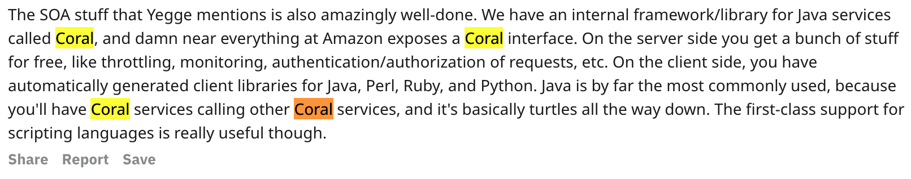

coral 是一个亚马逊内部的一个 rpc 框架，支持多语言，有十几年历史，Steve Yegge 还在亚马逊工作的时候就有了。

在 [亚马逊高效研发的秘密](https://mp.weixin.qq.com/s/bd8ODr2FdhL3TOrmyhGIOw) 一文中对  coral 的介绍：

> 在公司范围内，亚马逊对一些关键的技术架构做了强制或推荐。
> 
> 比如，RPC 必须用 Coral，定时任务应该用 DJS（Distributed Job Scheduler），工作流推荐用 SWF，消息中间件推荐 SQS 等等。

备注：反复google，基本找不到 Coral 的任何公开的详细资料，应该是内部使用而且没有对外宣传。

​		

​		

​		

- 今天 16:05

